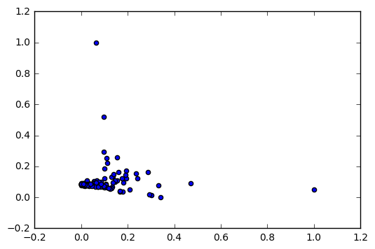

# python_correlation_to_vos
The objective: See how countries group on clusters driven by the correlation between them using the features from the "Global Information Technology Report, 2016" data. The visualization will be done using VOS Viewer.


```python
import pandas as pd
from sklearn import decomposition as pcad
from sklearn.preprocessing import normalize as norm
import matplotlib.pyplot as plt
import numpy as np
```

### Download the data from http://knoema.es/atlas/sources/WEF

Read the data and put it in a dataframe


```python
gitr_data=pd.read_csv("ObservationData_nkzdwfb.csv",sep=",")
```

See which columns are available


```python
gitr_data.columns
```


    Index(['country', 'indicator', 'measure', 'Unit', 'Date', 'Value'], dtype='object')


See which countries are available


```python
countries=gitr_data['country'].unique()
countries
```


    array(['Australia', 'Austria', 'Belgium', 'Canada', 'Cyprus',
           'Czech Republic', 'Denmark', 'Estonia', 'Finland', 'France',
           'Germany', 'Greece', 'Hong Kong SAR', 'Iceland', 'Ireland',
           'Israel', 'Italy', 'Japan', 'Korea, Rep.', 'Latvia', 'Luxembourg',
           'Malta', 'Netherlands', 'New Zealand', 'Norway', 'Portugal',
           'Singapore', 'Slovak Republic', 'Slovenia', 'Spain', 'Sweden',
           'Switzerland', 'Taiwan, China', 'United Kingdom', 'United States',
           'Armenia', 'Azerbaijan', 'Georgia', 'Kazakhstan', 'Kyrgyz Republic',
           'Moldova', 'Russian Federation', 'Tajikistan', 'Ukraine',
           'Bangladesh', 'Bhutan', 'Cambodia', 'China', 'India', 'Indonesia',
           'Lao PDR', 'Malaysia', 'Mongolia', 'Myanmar', 'Nepal',
           'Philippines', 'Sri Lanka', 'Thailand', 'Vietnam', 'Albania',
           'Bosnia and Herzegovina', 'Bulgaria', 'Croatia', 'Hungary',
           'Lithuania', 'Macedonia, FYR', 'Montenegro', 'Poland', 'Romania',
           'Serbia', 'Turkey', 'Argentina', 'Bolivia', 'Brazil', 'Chile',
           'Colombia', 'Costa Rica', 'Dominican Republic', 'Ecuador',
           'El Salvador', 'Guatemala', 'Guyana', 'Haiti', 'Honduras',
           'Jamaica', 'Mexico', 'Nicaragua', 'Panama', 'Paraguay', 'Peru',
           'Trinidad and Tobago', 'Uruguay', 'Venezuela', 'Algeria', 'Bahrain',
           'Egypt', 'Iran, Islamic Rep.', 'Jordan', 'Kuwait', 'Lebanon',
           'Mauritania', 'Morocco', 'Oman', 'Pakistan', 'Qatar',
           'Saudi Arabia', 'Tunisia', 'United Arab Emirates', 'Benin',
           'Botswana', 'Burundi', 'Cameroon', 'Cape Verde', 'Chad',
           "Côte d'Ivoire", 'Ethiopia', 'Gabon', 'Gambia, The', 'Ghana',
           'Guinea', 'Kenya', 'Lesotho', 'Liberia', 'Madagascar', 'Malawi',
           'Mali', 'Mauritius', 'Mozambique', 'Namibia', 'Nigeria', 'Rwanda',
           'Senegal', 'Seychelles', 'South Africa', 'Swaziland', 'Tanzania',
           'Uganda', 'Zambia', 'Zimbabwe'], dtype=object)


Looking which fields are important for features, values and identification


```python
gitr_data[gitr_data['country']=='Uganda'][['country','indicator','Value']].head(3)
```


<div>
<table border="1" class="dataframe">
  <thead>
    <tr style="text-align: right;">
      <th></th>
      <th>country</th>
      <th>indicator</th>
      <th>Value</th>
    </tr>
  </thead>
  <tbody>
    <tr>
      <th>9146</th>
      <td>Uganda</td>
      <td>Networked Readiness Index</td>
      <td>3.1</td>
    </tr>
    <tr>
      <th>9147</th>
      <td>Uganda</td>
      <td>Environment subindex</td>
      <td>3.7</td>
    </tr>
    <tr>
      <th>9148</th>
      <td>Uganda</td>
      <td>Political and regulatory environment</td>
      <td>3.7</td>
    </tr>
  </tbody>
</table>
</div>


Test modifying a country data so it behaves as a set of features for an observation


```python
gitr_data[gitr_data['country']=='Uganda'][['indicator','Value']].set_index('indicator').rename(columns={'Value':'Uganda'}).transpose()
```


<div>
<table border="1" class="dataframe">
  <thead>
    <tr style="text-align: right;">
      <th>indicator</th>
      <th>Networked Readiness Index</th>
      <th>Environment subindex</th>
      <th>Political and regulatory environment</th>
      <th>Effectiveness of law-making bodies, 1-7 (best)</th>
      <th>Laws relating to ICTs, 1-7 (best)</th>
      <th>Judicial independence, 1-7 (best)</th>
      <th>Efficiency of legal system in settling disputes, 1-7 (best)</th>
      <th>Efficiency of legal system in challenging regs, 1-7 (best)</th>
      <th>Intellectual property protection, 1-7 (best)</th>
      <th>No. procedures to enforce a contract</th>
      <th>...</th>
      <th>Economic impacts</th>
      <th>Impact of ICTs on new services &amp; products, 1-7 (best)</th>
      <th>ICT PCT patents, applications/million pop.</th>
      <th>Impact of ICTs on new organizational models, 1-7 (best)</th>
      <th>Knowledge-intensive jobs, % workforce</th>
      <th>Social impacts</th>
      <th>Impact of ICTs on access to basic services, 1-7 (best)</th>
      <th>Internet access in schools, 1-7 (best)</th>
      <th>ICT use &amp; gov’t efficiency, 1-7 (best)</th>
      <th>E-Participation Index, 0–1 (best)</th>
    </tr>
  </thead>
  <tbody>
    <tr>
      <th>Uganda</th>
      <td>3.1</td>
      <td>3.7</td>
      <td>3.7</td>
      <td>4.0</td>
      <td>3.4</td>
      <td>3.4</td>
      <td>3.8</td>
      <td>3.6</td>
      <td>3.3</td>
      <td>38.0</td>
      <td>...</td>
      <td>2.6</td>
      <td>4.3</td>
      <td>0.0</td>
      <td>3.7</td>
      <td>4.1</td>
      <td>3.1</td>
      <td>3.5</td>
      <td>3.2</td>
      <td>4.0</td>
      <td>0.14</td>
    </tr>
  </tbody>
</table>
<p>1 rows × 67 columns</p>
</div>


Generalizing the previous step to all the data


```python
dfA=list()
for country in countries:
    df=gitr_data[gitr_data['country']==country][['indicator','Value']].set_index('indicator').rename(columns={'Value':country}).transpose()
    dfA.append(df)
gitr_featured=pd.concat(dfA)
```

Looking the results


```python
gitr_featured.head(3)
```


<div>
<table border="1" class="dataframe">
  <thead>
    <tr style="text-align: right;">
      <th></th>
      <th>Availability of latest technologies, 1-7 (best)</th>
      <th>Business and innovation environment</th>
      <th>Business usage</th>
      <th>Business-to-business Internet use, 1-7 (best)</th>
      <th>Business-to-consumer Internet use, 1-7 (best)</th>
      <th>Capacity for innovation, 1-7 (best)</th>
      <th>Economic impacts</th>
      <th>Effectiveness of law-making bodies, 1-7 (best)</th>
      <th>Efficiency of legal system in challenging regs, 1-7 (best)</th>
      <th>Efficiency of legal system in settling disputes, 1-7 (best)</th>
      <th>...</th>
      <th>Quality of management schools, 1-7 (best)</th>
      <th>Quality of math &amp; science education, 1-7 (best)</th>
      <th>Readiness subindex</th>
      <th>Secure Internet servers/million pop.</th>
      <th>Skills</th>
      <th>Social impacts</th>
      <th>Total tax rate, % profits</th>
      <th>Usage subindex</th>
      <th>Use of virtual social networks, 1-7 (best)</th>
      <th>Venture capital availability, 1-7 (best)</th>
    </tr>
  </thead>
  <tbody>
    <tr>
      <th>Australia</th>
      <td>5.9</td>
      <td>5.1</td>
      <td>4.8</td>
      <td>5.5</td>
      <td>5.5</td>
      <td>4.8</td>
      <td>4.7</td>
      <td>4.8</td>
      <td>4.7</td>
      <td>4.9</td>
      <td>...</td>
      <td>5.3</td>
      <td>4.8</td>
      <td>6.2</td>
      <td>1348.6</td>
      <td>6.0</td>
      <td>5.7</td>
      <td>47.6</td>
      <td>5.4</td>
      <td>6.0</td>
      <td>3.1</td>
    </tr>
    <tr>
      <th>Austria</th>
      <td>6.1</td>
      <td>4.7</td>
      <td>5.6</td>
      <td>5.7</td>
      <td>5.4</td>
      <td>5.4</td>
      <td>4.9</td>
      <td>4.2</td>
      <td>4.7</td>
      <td>5.0</td>
      <td>...</td>
      <td>4.9</td>
      <td>4.6</td>
      <td>6.3</td>
      <td>1267.7</td>
      <td>5.7</td>
      <td>5.2</td>
      <td>51.7</td>
      <td>5.4</td>
      <td>5.8</td>
      <td>2.9</td>
    </tr>
    <tr>
      <th>Belgium</th>
      <td>6.2</td>
      <td>5.1</td>
      <td>5.2</td>
      <td>5.7</td>
      <td>5.3</td>
      <td>5.3</td>
      <td>4.9</td>
      <td>4.3</td>
      <td>4.7</td>
      <td>4.5</td>
      <td>...</td>
      <td>6.0</td>
      <td>6.0</td>
      <td>6.1</td>
      <td>854.2</td>
      <td>6.4</td>
      <td>5.1</td>
      <td>58.4</td>
      <td>5.2</td>
      <td>6.1</td>
      <td>3.5</td>
    </tr>
  </tbody>
</table>
<p>3 rows × 54 columns</p>
</div>


As we have seen, there are some NaN values. For this particular case, they won't help to identify features. Therefore we drop them out


```python
gitr_featured.dropna(axis=1,inplace=True)
gitr_featured.head(3)
```


<div>
<table border="1" class="dataframe">
  <thead>
    <tr style="text-align: right;">
      <th></th>
      <th>Availability of latest technologies, 1-7 (best)</th>
      <th>Business and innovation environment</th>
      <th>Business usage</th>
      <th>Business-to-business Internet use, 1-7 (best)</th>
      <th>Business-to-consumer Internet use, 1-7 (best)</th>
      <th>Capacity for innovation, 1-7 (best)</th>
      <th>Economic impacts</th>
      <th>Effectiveness of law-making bodies, 1-7 (best)</th>
      <th>Efficiency of legal system in challenging regs, 1-7 (best)</th>
      <th>Efficiency of legal system in settling disputes, 1-7 (best)</th>
      <th>...</th>
      <th>Quality of management schools, 1-7 (best)</th>
      <th>Quality of math &amp; science education, 1-7 (best)</th>
      <th>Readiness subindex</th>
      <th>Secure Internet servers/million pop.</th>
      <th>Skills</th>
      <th>Social impacts</th>
      <th>Total tax rate, % profits</th>
      <th>Usage subindex</th>
      <th>Use of virtual social networks, 1-7 (best)</th>
      <th>Venture capital availability, 1-7 (best)</th>
    </tr>
  </thead>
  <tbody>
    <tr>
      <th>Australia</th>
      <td>5.9</td>
      <td>5.1</td>
      <td>4.8</td>
      <td>5.5</td>
      <td>5.5</td>
      <td>4.8</td>
      <td>4.7</td>
      <td>4.8</td>
      <td>4.7</td>
      <td>4.9</td>
      <td>...</td>
      <td>5.3</td>
      <td>4.8</td>
      <td>6.2</td>
      <td>1348.6</td>
      <td>6.0</td>
      <td>5.7</td>
      <td>47.6</td>
      <td>5.4</td>
      <td>6.0</td>
      <td>3.1</td>
    </tr>
    <tr>
      <th>Austria</th>
      <td>6.1</td>
      <td>4.7</td>
      <td>5.6</td>
      <td>5.7</td>
      <td>5.4</td>
      <td>5.4</td>
      <td>4.9</td>
      <td>4.2</td>
      <td>4.7</td>
      <td>5.0</td>
      <td>...</td>
      <td>4.9</td>
      <td>4.6</td>
      <td>6.3</td>
      <td>1267.7</td>
      <td>5.7</td>
      <td>5.2</td>
      <td>51.7</td>
      <td>5.4</td>
      <td>5.8</td>
      <td>2.9</td>
    </tr>
    <tr>
      <th>Belgium</th>
      <td>6.2</td>
      <td>5.1</td>
      <td>5.2</td>
      <td>5.7</td>
      <td>5.3</td>
      <td>5.3</td>
      <td>4.9</td>
      <td>4.3</td>
      <td>4.7</td>
      <td>4.5</td>
      <td>...</td>
      <td>6.0</td>
      <td>6.0</td>
      <td>6.1</td>
      <td>854.2</td>
      <td>6.4</td>
      <td>5.1</td>
      <td>58.4</td>
      <td>5.2</td>
      <td>6.1</td>
      <td>3.5</td>
    </tr>
  </tbody>
</table>
<p>3 rows × 54 columns</p>
</div>


Now to see the relationship between these countries based on the previous features we proceed with a correlation as a way to measure their similarities


```python
gitr_featured_cor=gitr_featured.transpose().corr()
gitr_featured_cor.head(3)
```


<div>
<table border="1" class="dataframe">
  <thead>
    <tr style="text-align: right;">
      <th></th>
      <th>Australia</th>
      <th>Austria</th>
      <th>Belgium</th>
      <th>Canada</th>
      <th>Cyprus</th>
      <th>Czech Republic</th>
      <th>Denmark</th>
      <th>Estonia</th>
      <th>Finland</th>
      <th>France</th>
      <th>...</th>
      <th>Nigeria</th>
      <th>Rwanda</th>
      <th>Senegal</th>
      <th>Seychelles</th>
      <th>South Africa</th>
      <th>Swaziland</th>
      <th>Tanzania</th>
      <th>Uganda</th>
      <th>Zambia</th>
      <th>Zimbabwe</th>
    </tr>
  </thead>
  <tbody>
    <tr>
      <th>Australia</th>
      <td>1.000000</td>
      <td>0.999051</td>
      <td>0.999036</td>
      <td>0.998181</td>
      <td>0.969107</td>
      <td>0.998389</td>
      <td>0.978675</td>
      <td>0.999417</td>
      <td>0.999850</td>
      <td>0.998703</td>
      <td>...</td>
      <td>0.311444</td>
      <td>0.107942</td>
      <td>0.336468</td>
      <td>0.976881</td>
      <td>0.990290</td>
      <td>0.347628</td>
      <td>0.211794</td>
      <td>0.172799</td>
      <td>0.827180</td>
      <td>0.839193</td>
    </tr>
    <tr>
      <th>Austria</th>
      <td>0.999051</td>
      <td>1.000000</td>
      <td>0.998264</td>
      <td>0.994747</td>
      <td>0.973076</td>
      <td>0.996397</td>
      <td>0.986235</td>
      <td>0.997240</td>
      <td>0.999249</td>
      <td>0.996108</td>
      <td>...</td>
      <td>0.323523</td>
      <td>0.122125</td>
      <td>0.348182</td>
      <td>0.979360</td>
      <td>0.986749</td>
      <td>0.359351</td>
      <td>0.224660</td>
      <td>0.185864</td>
      <td>0.830226</td>
      <td>0.841962</td>
    </tr>
    <tr>
      <th>Belgium</th>
      <td>0.999036</td>
      <td>0.998264</td>
      <td>1.000000</td>
      <td>0.997659</td>
      <td>0.975854</td>
      <td>0.999255</td>
      <td>0.977800</td>
      <td>0.998858</td>
      <td>0.998776</td>
      <td>0.999050</td>
      <td>...</td>
      <td>0.341094</td>
      <td>0.138935</td>
      <td>0.366025</td>
      <td>0.982619</td>
      <td>0.993838</td>
      <td>0.376880</td>
      <td>0.242443</td>
      <td>0.203543</td>
      <td>0.844511</td>
      <td>0.855208</td>
    </tr>
  </tbody>
</table>
<p>3 rows × 139 columns</p>
</div>


We must consider that correlations are also negative. Thus, we need to normalize them from zero to one, in order to use the results in VOS Viewer network. This is because the network file can't have negative values


```python
gitr_featured_cor=(gitr_featured_cor-gitr_featured_cor.min())/(gitr_featured_cor.max()-gitr_featured_cor.min())
gitr_featured_cor.head(3)
```


<div>
<table border="1" class="dataframe">
  <thead>
    <tr style="text-align: right;">
      <th></th>
      <th>Australia</th>
      <th>Austria</th>
      <th>Belgium</th>
      <th>Canada</th>
      <th>Cyprus</th>
      <th>Czech Republic</th>
      <th>Denmark</th>
      <th>Estonia</th>
      <th>Finland</th>
      <th>France</th>
      <th>...</th>
      <th>Nigeria</th>
      <th>Rwanda</th>
      <th>Senegal</th>
      <th>Seychelles</th>
      <th>South Africa</th>
      <th>Swaziland</th>
      <th>Tanzania</th>
      <th>Uganda</th>
      <th>Zambia</th>
      <th>Zimbabwe</th>
    </tr>
  </thead>
  <tbody>
    <tr>
      <th>Australia</th>
      <td>1.000000</td>
      <td>0.999011</td>
      <td>0.998977</td>
      <td>0.998139</td>
      <td>0.957836</td>
      <td>0.998276</td>
      <td>0.977652</td>
      <td>0.999397</td>
      <td>0.999847</td>
      <td>0.998654</td>
      <td>...</td>
      <td>0.217694</td>
      <td>0.057786</td>
      <td>0.230165</td>
      <td>0.969689</td>
      <td>0.988994</td>
      <td>0.242101</td>
      <td>0.137830</td>
      <td>0.115076</td>
      <td>0.740485</td>
      <td>0.758195</td>
    </tr>
    <tr>
      <th>Austria</th>
      <td>0.999025</td>
      <td>1.000000</td>
      <td>0.998158</td>
      <td>0.994626</td>
      <td>0.963252</td>
      <td>0.996145</td>
      <td>0.985575</td>
      <td>0.997146</td>
      <td>0.999236</td>
      <td>0.995961</td>
      <td>...</td>
      <td>0.231418</td>
      <td>0.072768</td>
      <td>0.243755</td>
      <td>0.972939</td>
      <td>0.984980</td>
      <td>0.255719</td>
      <td>0.151903</td>
      <td>0.129053</td>
      <td>0.745059</td>
      <td>0.762360</td>
    </tr>
    <tr>
      <th>Belgium</th>
      <td>0.999010</td>
      <td>0.998191</td>
      <td>1.000000</td>
      <td>0.997605</td>
      <td>0.967044</td>
      <td>0.999203</td>
      <td>0.976735</td>
      <td>0.998819</td>
      <td>0.998754</td>
      <td>0.999014</td>
      <td>...</td>
      <td>0.251381</td>
      <td>0.090522</td>
      <td>0.264457</td>
      <td>0.977212</td>
      <td>0.993016</td>
      <td>0.276084</td>
      <td>0.171355</td>
      <td>0.147966</td>
      <td>0.766510</td>
      <td>0.782278</td>
    </tr>
  </tbody>
</table>
<p>3 rows × 139 columns</p>
</div>


Finally, we proceed to save the results. But, we have to consider that a VOS network file, starts without a header. ID and values to the right, no column headers. Therefore, we proceed to omit it.


```python
gitr_featured_cor.to_csv("gitr_featured_cor.csv",header=False)
```

# OPTIONAL: Transform the features from many to 2. And test the results


```python
pca = pcad.PCA(n_components=2)
pca.fit(gitr_featured)
X = pca.transform(gitr_featured)
```


```python
Xn=(X-X.min(axis=0))/(X.max(axis=0)-X.min(axis=0))
```


```python
fig = plt.figure()
plt.scatter(Xn[:,0],Xn[:,1])
plt.show()
```





```python
pd.DataFrame(Xn).set_index(gitr_featured.index).rename(columns={0:'F1',1:'F2'}).head(3)
```


<div>
<table border="1" class="dataframe">
  <thead>
    <tr style="text-align: right;">
      <th></th>
      <th>F1</th>
      <th>F2</th>
    </tr>
  </thead>
  <tbody>
    <tr>
      <th>Australia</th>
      <td>0.193104</td>
      <td>0.123688</td>
    </tr>
    <tr>
      <th>Austria</th>
      <td>0.136844</td>
      <td>0.135847</td>
    </tr>
    <tr>
      <th>Belgium</th>
      <td>0.131579</td>
      <td>0.130669</td>
    </tr>
  </tbody>
</table>
</div>


```python

```

#Then proceed to create the VOS network file

The created csv file looks like this:
 

Then open VOS Viewer and create a network file
 

Then select the csv file:
 

Then press next, and finish
 

Finally, see the cluster image of countries
 
 
